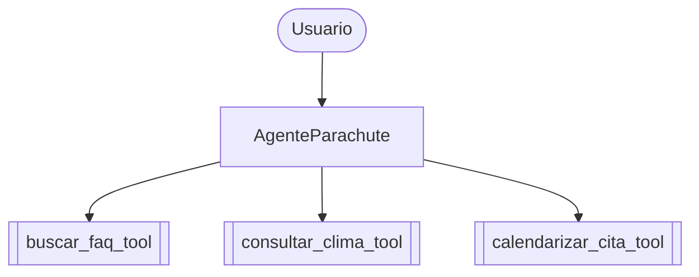
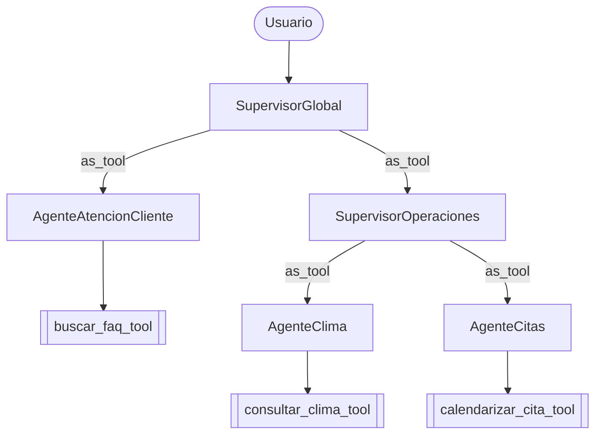
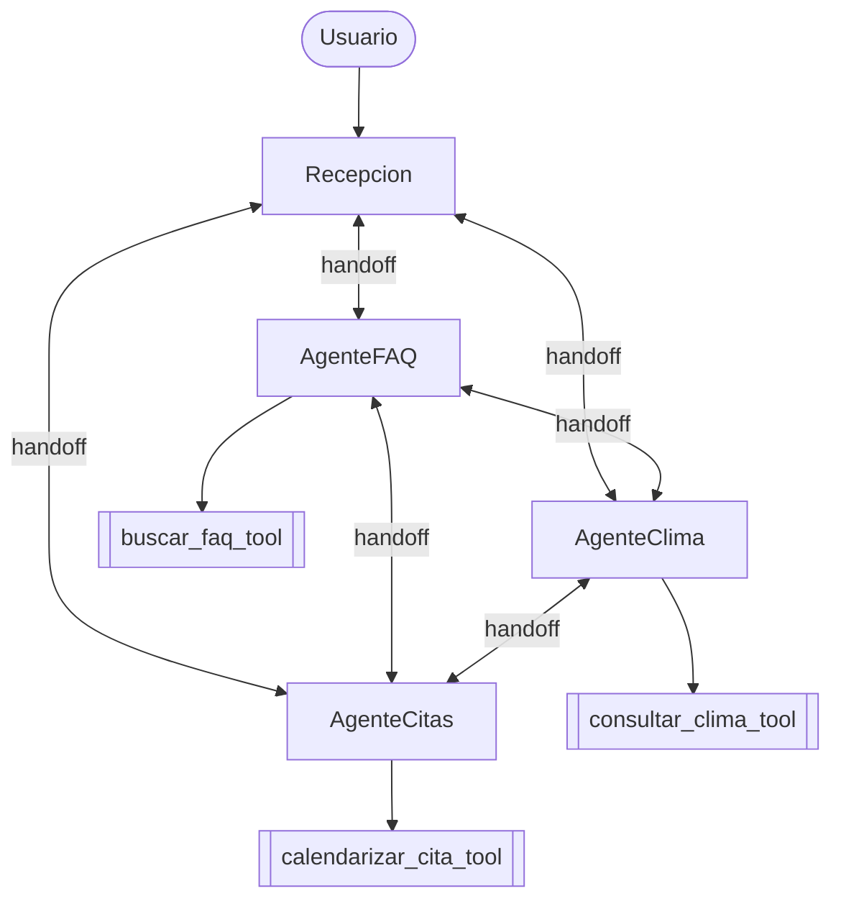

# Arquitecturas de orquestación multiagente

Las tres arquitecturas resuelven el mismo problema (FAQs, consulta de clima
y agendamiento de citas de salto) reutilizando la misma lógica de
integración (`src/common/`); únicamente cambia cómo se organizan y se
comunican los agentes.

## 1. Centralizada (`src/agente_centralizado.py`)

Un único agente controla directamente las tres herramientas. No existe
ningún tipo de delegación entre agentes.

## 2. Jerárquica (`src/agente_jerarquico.py`)

Un supervisor global delega en especialistas mediante `Agent.as_tool()`.
Uno de esos especialistas (Operaciones) es a su vez un supervisor de otros
dos agentes. Hay varios niveles de autoridad: el supervisor global nunca
llama las herramientas directamente, siempre delega.

## 3. Decentralizada (`src/agente_decentralizado.py`)

Agentes pares se transfieren la conversación entre sí mediante `handoff()`.
Ningún agente retiene el control central de toda la conversación: quien la
tiene en un momento dado decide a quién transferirla a continuación.

